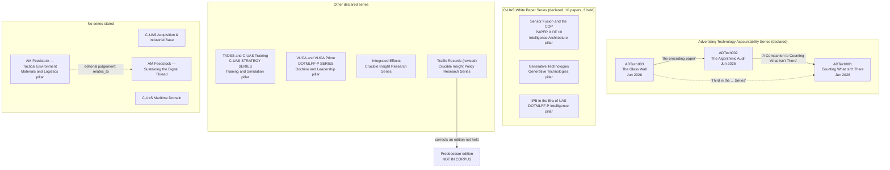

# 7. Relationship graph

Only relationships the documents themselves state are recorded as stated. Where a
relationship is an editorial judgement, it is labelled as one. Nothing is inferred
from subject similarity alone.

## 7.1 The graph

Solid edges are stated by a document. Dotted edges are editorial judgement or point
at something the platform does not hold.

## 7.2 Stated relationships

### The advertising-technology trilogy — the only fully stated sequence

| Edge | The words in the document |
|---|---|
| ADTech002 → ADTech001 | cover line: *"A Companion to 'Counting What Isn't There'"* |
| ADTech003 → series | cover line: *"Third in the Advertising Technology Accountability Series"* |
| ADTech003 → ADTech002 | executive summary: *"the forensic AI methods documented in the preceding paper"* |

Three documents, an explicit ordinal for the third, an explicit companion link for
the second, and a named series. The corpus holds all three. This is the cleanest
`part_of_collection` fixture available and should be the first collection modelled.

Note the series name is asserted only by ADTech003; ADTech001 and ADTech002 do not
name it. Membership of 001 and 002 is therefore inferred from 003's statement plus
the companion link — defensible, and worth recording as such.

### The C-UAS White Paper Series — declared size 10, three members held

Sensor Fusion states `PAPER 9 OF 10`. C-UAS Generative and IPB carry the
`C-UAS WHITE PAPER SERIES` banner without a number.

Two consequences:

1. **The collection has a declared total the platform cannot satisfy.** A series page
   saying "3 papers" is accurate about what is held; saying "Paper 9 of 10" on the
   Sensor Fusion page is accurate about what the document claims. Both are true and
   both should render. The platform must not silently renumber the three held papers
   1, 2, 3.
2. **Positions are unknown for two of the three.** Only paper 9's position is stated.
   `content_relationships.position` defaults to 0; assigning 1 and 2 to the other two
   would invent an order. Recommendation: record position 9 for Sensor Fusion and
   leave the others at 0 with the series page ordered by stated date, and record the
   unknown positions in the collection's own description.

### The other four declared series each hold one member

`C-UAS STRATEGY SERIES` (TADSS), `DOTMLPF-P SERIES` (VUCA),
`Crucible Insight Research Series` (Integrated Effects),
`Crucible Insight Policy Research Series` (Traffic Records).

A series of one is still a series — the document says so. Create the collection,
attach the single member, and let it grow. Do not merge
`C-UAS STRATEGY SERIES` into `C-UAS WHITE PAPER SERIES` because they look similar:
they are different strings in different documents, and merging them is a taxonomy
decision for the client, not an ingestion decision.

`DOTMLPF-P SERIES` (VUCA's banner) and the `DOTMLPF-P INTELLIGENCE PILLAR` (IPB's
banner) are a series and a pillar respectively, not two references to one thing. See
[document 03](03-taxonomy-recommendations.md) T6.

### Two documents state no series at all

C-UAS Acquisition's banner is
`DEFENSE ACQUISITION POLICY | INDUSTRIAL BASE ANALYSIS` — a subject banner, not a
series. C-UxS Maritime states none. Neither should be assigned to the C-UAS series
because their subject fits; that would be exactly the kind of inference this
analysis is instructed not to make.

## 7.3 Editorial-judgement relationships

### The AM feedstock pair — `relates_to`, and flagged

*Managing Feedstocks for Additive Manufacturing in a Tactical Environment* and
*Sustaining the Digital Thread: Feedstock Supply Chain Challenges for
Forward-Deployed Additive Manufacturing Capabilities* were created a day apart
(12 and 13 April 2026 by Word's `dcterms:created`), share a subject, and overlap
heavily in sources — both cite DoDI 5000.93, the DoD AM Strategy, the FY2026 NDAA
additive-manufacturing provisions and the DODIG audits.

Neither mentions the other. A `relates_to` edge is a reasonable editorial judgement
and must be recorded as one, not presented as the documents' own statement.

They are also the corpus's near-duplicate retrieval case
([document 04](04-search-recommendations.md) R7).

### Shared-source relationships are derivable, not asserted

Once sources are ingested, "papers citing GAO-25-107283" and "papers citing DoDI
5000.93" fall out of `knowledge.claim_sources` joined through
`knowledge.sources`. That is a *derived* view over the evidence graph and should not
be duplicated as `content_relationships` rows — duplicating it would create two
answers that can disagree.

Observed overlaps worth noting as future evidence-graph edges:
DoDI 5000.93 (AM Tactical, AM White Paper, C-UAS Generative, TADSS);
JIATF 401 establishment memo (C-UAS Acquisition, Sensor Fusion, TADSS);
CEPA *An Urgent Matter of Drones* (IPB, Sensor Fusion);
FM 3-0 (IPB, VUCA);
GAO industrial-base and command-and-control reports across the C-UAS cluster.

## 7.4 The correction edge that cannot be created

Traffic Records is a revised edition whose predecessor is not held (F26). There is
nothing to point `supersedes_id` or a `corrects` relationship at.

[Document 06](06-workflow-validation.md) §6.8 sets out the resolution: publish as
version 1 with the revision statement in `correction_reason` and `correction_scope`,
render the notice, and create no edge. If the predecessor arrives later it becomes
version 1 and the revision becomes version 2, with the supersession recorded then.

## 7.5 How each relationship should be stored

`cms.content_relationships` permits `supersedes`, `corrects`, `relates_to`,
`part_of_collection`, `cites`.

| Relationship | Mechanism | Notes |
|---|---|---|
| Series membership | a `collection` content item + `part_of_collection` with `position` | Six collections; one has a declared total it cannot fill (§7.2) |
| ADTech002 → ADTech001 companion | `relates_to` **in addition to** collection membership | The companion link is a specific claim, stronger than co-membership |
| ADTech003 → ADTech002 "preceding paper" | carried by `position` within the collection | A separate edge would duplicate the ordering |
| AM pair | `relates_to`, flagged as editorial judgement | §7.3 |
| Citation between Crucible Insight papers | `cites` | **None observed.** No corpus document cites another as a source; the ADTech links are companion references, not citations |
| Traffic Records supersession | none creatable | §7.4 |

`cites` is unexercised by this corpus. Recorded as a coverage gap.

## 7.6 Collections to create

Six, with their members:

| Collection | Members held | Declared size |
|---|---|---|
| Advertising Technology Accountability Series | ADTech001, ADTech002, ADTech003 | 3 (all held) |
| C-UAS White Paper Series | Sensor Fusion (pos. 9), C-UAS Generative, IPB | 10 declared, 3 held |
| C-UAS Strategy Series | TADSS | not stated |
| DOTMLPF-P Series | VUCA | not stated |
| Crucible Insight Research Series | Integrated Effects | not stated |
| Crucible Insight Policy Research Series | Traffic Records | not stated |

Ten of the fourteen documents fall into a collection. The remaining four —
C-UAS Acquisition, C-UxS Maritime and the two AM feedstock papers — state no series.
The AM pair is joined by the `relates_to` judgement of §7.3; the other two stand
alone.

A collection is itself a content item with a version, a canonical URL and a title,
so creating six collections means creating six more content items. That is the cost
of modelling series properly, and it buys a browsable series page and a stable URL
per series.
